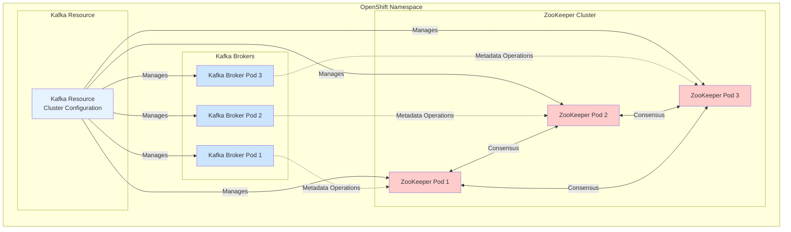
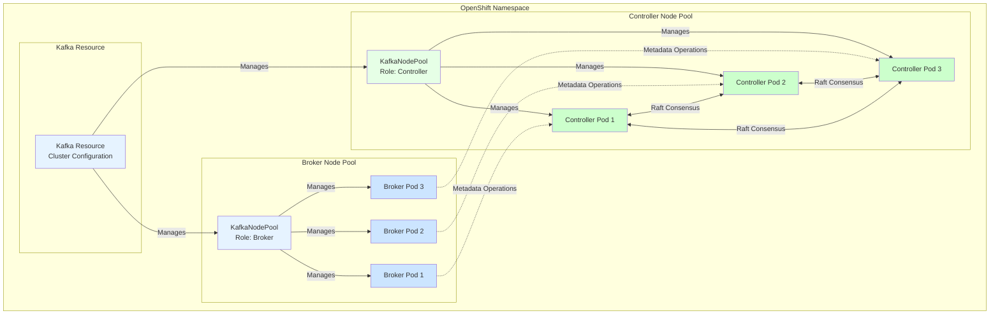

# Mermaid Diagrams for Kafka Architecture

This file contains the Mermaid diagram code for generating the architecture diagrams used in the README.

## ZooKeeper-Based Architecture (Legacy)

Save this as `kafka-zookeeper-architecture.jpg`:



## KRaft-Based Architecture (Modern)

Save this as `kafka-kraft-architecture.jpg`:



## How to Generate JPG Files

### Option 1: Using Mermaid Live Editor (Online)
1. Go to https://mermaid.live/
2. Paste one of the Mermaid code blocks above (without the markdown code fences)
3. Click "Download PNG" or use a screenshot tool to save as JPG
4. Save as `kafka-zookeeper-architecture.jpg` or `kafka-kraft-architecture.jpg` in the `images/` directory

### Option 2: Using Mermaid CLI
```bash
# Install Mermaid CLI
npm install -g @mermaid-js/mermaid-cli

# Generate images
mmdc -i mermaid-diagrams.md -o images/kafka-zookeeper-architecture.jpg -t dark
mmdc -i mermaid-diagrams.md -o images/kafka-kraft-architecture.jpg -t dark
```

### Option 3: Using VS Code Extension
1. Install the "Markdown Preview Mermaid Support" extension
2. Open this file in VS Code
3. Use the preview to view the diagrams
4. Export or screenshot the diagrams as JPG files

### Option 4: Using Online Converters
- https://mermaid.ink/ - Paste the code and download as image
- https://kroki.io/ - Supports Mermaid and can export as JPG

